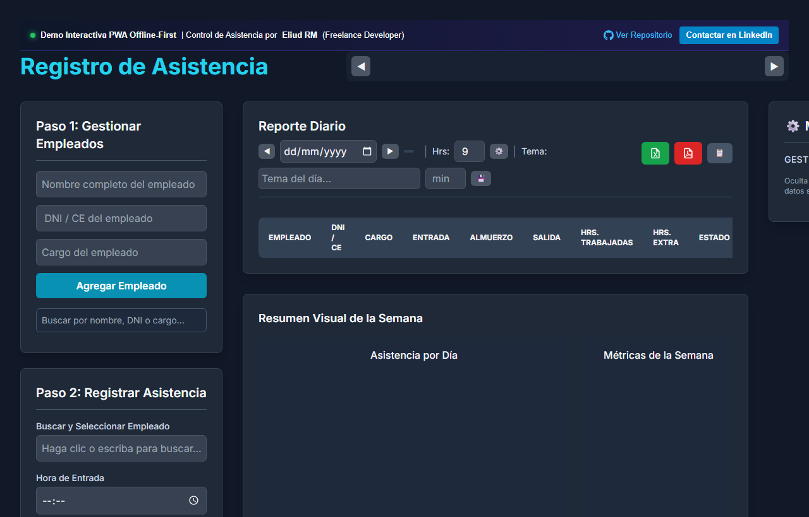
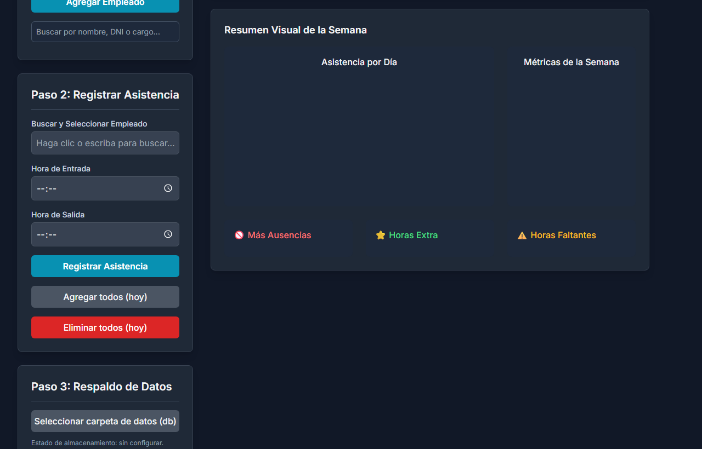

# ⏱️ Attendance Tracker PWA — Control de Asistencia Offline-First
> **Progressive Web App (PWA) de alto rendimiento para el control de asistencia de personal, gestión de sedes, reportes inmediatos en Excel/PDF y analítica visual con Chart.js.**

  
  

  
  

---

## 📌 El Desafío de Negocio

La gestión y control de asistencia de empleados en faenas de campo, obras en construcción, eventos masivos o almacenes remotos presenta graves problemas cotidianos:
- **Falta de Conectividad a Internet**: Las aplicaciones en la nube fallan o se congelan en zonas con cobertura deficiente, paralizando el ingreso del personal.
- **Uso de Planillas en Papel**: Tomar asistencia a mano deriva en firmas ilegibles, pérdida física de hojas, fraudes de horarios y retrasos de días para pasar los datos a Excel.
- **Cierre de Nómina Lento y Agotador**: El equipo de Recursos Humanos invierte días enteros consolidando horas trabajadas, turnos y faltas de cada sede antes de procesar pagos.
- **Falta de Visibilidad Operativa**: La gerencia no sabe cuántas personas están realmente presentes en cada sede hasta que termina la jornada.

---

## 💡 La Solución Implementada

**Attendance Tracker PWA** es una aplicación web progresiva diseñada bajo la filosofía **Offline-First**, lo que significa que funciona al 100% incluso sin internet:

1. **Service Workers y Almacenamiento Local (`sw.js` & `storage-simple.js`)**:
   - Cachea los recursos de la aplicación para apertura instantánea.
   - Guarda los registros de asistencia en el dispositivo de forma persistente y segura, garantizando cero pérdidas de información ante caídas de red.
2. **Gestión Multisede y Control de Personal**:
   - Selector dinámico de sucursales o frentes de trabajo con validaciones de hora de entrada, salida y estado.
3. **Generación Instantánea de Reportes (Excel & PDF en 1 clic)**:
   - Exporta la asistencia del día o del mes en hojas de cálculo `.xlsx` formateadas (`xlsx.full.min.js`).
   - Genera reportes oficiales en `.pdf` listos para impresión con tablas estructuradas (`jsPDF` y `jspdf-autotable`).
4. **Dashboard Estadístico Interactivo (`Chart.js`)**:
   - Visualización de porcentajes de puntualidad, ausentismo y distribución de personal por sedes en tiempo real.

👉 **[Prueba la Demo Interactiva en Vivo aquí](https://enybyy.github.io/attendance-tracker-pwa/)**

---

## 📈 Impacto y Mejoras Conseguidas

| Factor Operativo | Sin Attendance Tracker PWA | Con Attendance Tracker PWA | Impacto Conseguido |
|---|---|---|---|
| **Disponibilidad en Terreno** | Inoperable sin señal de internet | Operatividad ininterrumpida Offline-First | **100% de disponibilidad en cualquier locación** |
| **Tiempo de Marcaje** | Filas lentas y llenado manual en papel | Marcaje digital rápido en segundos | **Fluidez en el ingreso del personal** |
| **Generación de Reportes** | Días de digitación manual para nómina | Exportación inmediata a Excel y PDF | **Ahorro del 90% del tiempo de consolidación de RRHH** |
| **Costos de Adopción** | Adquisición de relojes biométricos costosos | Funciona en cualquier smartphone o tablet existente | **Cero inversión en hardware especializado** |

---

## ✨ Funcionalidades Principales

- **Instalación como Aplicación Móvil o de Escritorio**: Gracias a su `manifest.json`, puede instalarse en Android, iOS o Windows con icono propio, sin pasar por App Store ni Play Store.
- **Filtrado Dinámico por Sede y Fecha**: Segmentación rápida de asistencia por punto de trabajo.
- **Exportación Multi-Formato**:
  - **Excel**: Reportes de nómina detallados listos para importar a sistemas de planillas.
  - **PDF**: Hojas formales de asistencia para archivo físico o auditorías laborales.
- **Gráficos de Asistencia en Vivo**: Métricas visuales de asistencia diaria y mensual con `Chart.js`.
- **Diseño Moderno y Responsivo**: Construido con Tailwind CSS en tema oscuro elegante, optimizado para uso con guantes o bajo luz solar intensa.

---

## 🛠️ Stack Tecnológico

- **PWA Core**: Progressive Web App API, Web App Manifest (`manifest.json`), Service Worker (`sw.js`).
- **Frontend**: HTML5 Semántico, Vanilla JavaScript (ES6+), Tailwind CSS.
- **Visualización de Datos**: Chart.js.
- **Exportación de Documentos**: SheetJS (`xlsx.full.min.js`), jsPDF, jsPDF-AutoTable, html2canvas.

---

## 📬 ¿Necesitas una aplicación offline o de gestión para tu empresa?

Desarrollo **Progressive Web Apps (PWA), sistemas de captura de datos en terreno, soluciones de gestión de personal y herramientas de reportería automatizada**.

- **LinkedIn**: [Eliud RM](https://www.linkedin.com/in/eliud-rojas-mendoza-414652212/)
- **GitHub**: [@Enybyy](https://github.com/Enybyy)
- *Disponible para proyectos freelance y consultorías de digitalización.*
