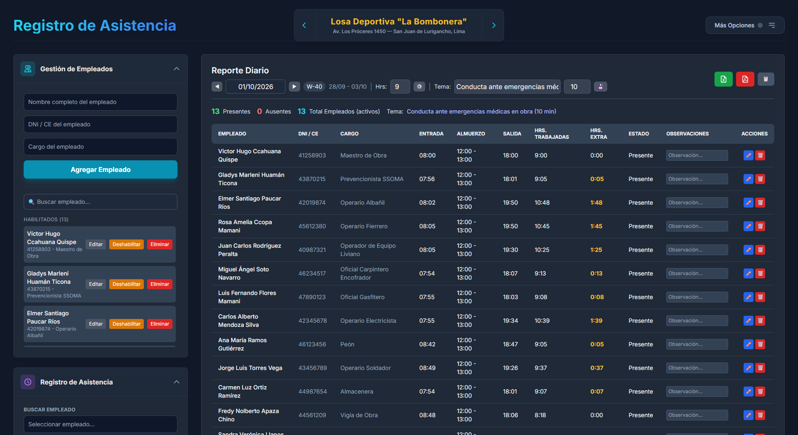
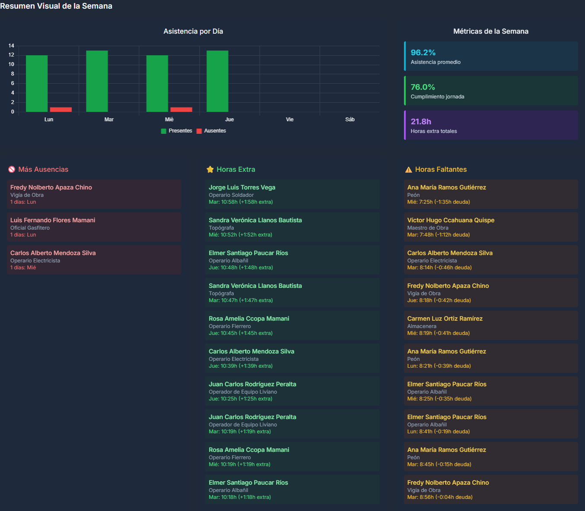
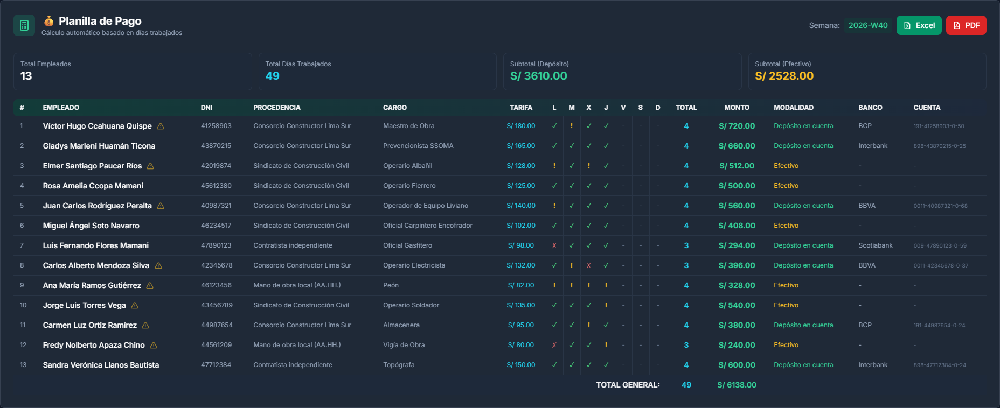
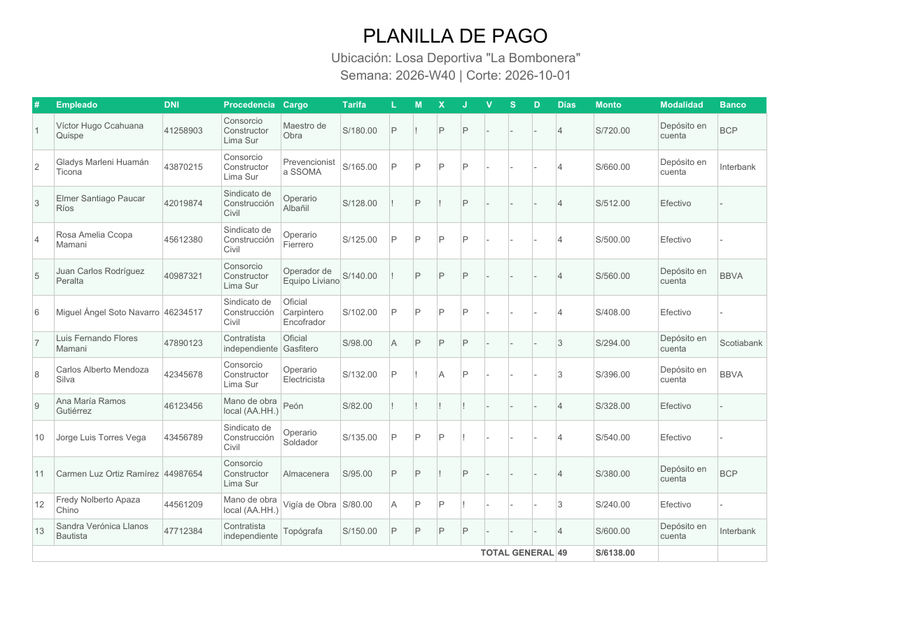

<div align="center">

# Attendance Tracker PWA

### Asistencia y registros semanales por sede.

Control de personal por sede, revisión de incidencias y planilla referencial con reportes en Excel y PDF. Una aplicación web para supervisores de obra y equipos SSOMA, que funciona en el navegador y conserva los datos en el dispositivo.

<a href="https://enybyy.github.io/attendance-tracker-pwa/"></a>

<p><a href="https://github.com/Enybyy"></a>
<a href="https://www.linkedin.com/in/eliud-rojas-mendoza-414652212/"></a>
<a href="https://www.upwork.com/freelancers/~01471ca462b236e8e5"></a></p>

[](https://enybyy.github.io/attendance-tracker-pwa/)

*Captura real del sistema. Los trabajadores, documentos, cuentas y montos de la demo son ficticios.*

[Acerca del proyecto](#acerca-del-proyecto) · [Demo y capturas](#explorar-el-sistema) · [Reportes](#reportes-listos-para-compartir) · [Tecnología](#cómo-está-construido)

</div>

## Acerca del proyecto

Attendance Tracker acompaña el registro diario de personal en obras con varios frentes de trabajo. En cada sede reúne los horarios, las observaciones de campo y las charlas de seguridad, manteniendo un historial que se puede consultar durante la semana.

El recorrido sigue la jornada del supervisor: seleccionar la sede, registrar la asistencia y revisar lo ocurrido. Al cierre, esa misma información da forma al resumen semanal y a la planilla referencial, sin volver a transcribir los registros para preparar los reportes.

## En el día a día

| Dentro de la aplicación | Detalle |
| --- | --- |
| Personal por sede | Cada obra conserva su lista de trabajadores, registros y movimientos de personal. |
| Jornadas y horarios | Las entradas y salidas se calculan por minuto, con el descanso y la jornada configurada como referencia. |
| Resumen semanal | Presentes, ausentes, horas extra y horas faltantes se reúnen en una vista para revisar la semana. |
| Planilla referencial | Los registros conservan su tarifa histórica; las incidencias y los descuentos quedan asociados a su revisión. |
| Archivos de trabajo | La asistencia y la planilla se exportan a Excel y PDF para continuar la revisión o compartirlas. |
| Continuidad en campo | Después de la primera carga en línea, la aplicación puede seguir utilizándose sin conexión en el mismo dispositivo. |

## Explorar el sistema

La [demo pública](https://enybyy.github.io/attendance-tracker-pwa/) comienza con **3 sedes y 34 trabajadores ficticios**, con un historial de ejemplo para recorrer el flujo completo.

1. Cambia de sede con las flechas del encabezado y elige una fecha del reporte.
2. Revisa la asistencia, los horarios y las observaciones del día.
3. Baja al resumen semanal y a la planilla; abre una incidencia para revisar su tratamiento.
4. Exporta un reporte. Usa **Reiniciar demo** para recuperar los ejemplos o **Empezar vacío** para iniciar tus propios registros.

> Cada navegador mantiene sus propios datos. Los cambios que hagas en la demo no modifican la información de otros visitantes. Reiniciar los ejemplos reemplaza los datos de ese navegador: exporta un respaldo si necesitas conservarlos.

<details>
<summary><strong>Ver el resumen semanal: asistencia, horas extra y horas faltantes</strong></summary>

El gráfico reúne presentes y ausentes por día. Los listados permiten localizar los trabajadores con incidencias y consultar las diferencias de horas registradas durante la semana.



</details>

<details>
<summary><strong>Ver la planilla: días registrados, tarifas y modalidades de pago</strong></summary>

La planilla agrupa los días trabajados y los importes por empleado. Permite revisar incidencias de jornada, registrar descuentos justificados y separar los totales por modalidad de pago.



Los reportes utilizan la fecha de corte seleccionada. Las horas extra se muestran para revisión; no generan un pago adicional automático. Esta planilla sirve como control operativo y no reemplaza un sistema de nómina laboral.

</details>

## Reportes listos para compartir

Estos archivos se exportaron directamente desde la aplicación con los datos ficticios de la demo. Corresponden al **1 de octubre de 2026**, dentro de la semana del 28 de septiembre al 4 de octubre; los registros posteriores al corte no se incluyen en el cálculo de la planilla.

| Documento | Excel editable | PDF para consulta e impresión |
| --- | --- | --- |
| Asistencia | [Descargar reporte diario](docs/reports/asistencia-demo.xlsx?raw=true) | [Ver reporte semanal](docs/reports/asistencia-demo.pdf) |
| Planilla referencial | [Descargar planilla](docs/reports/planilla-demo.xlsx?raw=true) | [Ver planilla](docs/reports/planilla-demo.pdf) |

<details>
<summary><strong>Ver una página del PDF de planilla</strong></summary>



[Abrir el PDF original](docs/reports/planilla-demo.pdf) · [Descargar el Excel de la misma planilla](docs/reports/planilla-demo.xlsx?raw=true)

</details>

## Cómo está construido

El proyecto combina una interfaz en JavaScript con reglas de asistencia, persistencia local y generación de documentos. El flujo permite conservar observaciones e historial, validar los respaldos antes de importarlos y mantener coherencia entre la planilla visible y sus exportaciones.

| Área | Tecnología |
| --- | --- |
| Interfaz | HTML, Tailwind CSS y CSS propio |
| Lógica | JavaScript con módulos ES |
| Gráficos | Chart.js |
| Documentos | SheetJS para XLSX; jsPDF, AutoTable y html2canvas para PDF |
| Datos | IndexedDB y respaldo local de contingencia |
| Instalación y uso sin conexión | Manifest PWA y Service Worker |
| Demo | GitHub Pages |
| Verificación | Pruebas de reglas con Node.js y pruebas de navegador con Playwright |

<details>
<summary><strong>Ejecutar el proyecto en tu equipo</strong></summary>

Necesitas Node.js. No hay compilación ni instalación de dependencias para abrir la aplicación desde el servidor local:

```bash
git clone https://github.com/Enybyy/attendance-tracker-pwa.git
cd attendance-tracker-pwa
npm start
```

Abre **http://127.0.0.1:4173**. Utiliza el servidor HTTP en lugar de abrir `index.html` directamente, porque la aplicación carga módulos ES y un Service Worker.

Para ejecutar las verificaciones de desarrollo:

```bash
npm ci
npm test
npm run test:e2e
```

Las pruebas de navegador utilizan Google Chrome instalado. Como alternativa, instala Chromium con `npx playwright install chromium` y ejecuta las pruebas con la variable de entorno `BROWSER_CHANNEL=chromium`.

</details>

<details>
<summary><strong>Datos, respaldos y alcance de la aplicación</strong></summary>

- La aplicación funciona sin backend, cuentas de usuario ni sincronización entre dispositivos. Guarda la información en el navegador; borrar sus datos también puede borrar los registros.
- El respaldo JSON permite exportar y recuperar la información. La vinculación opcional de una carpeta depende del soporte del navegador para File System Access API, principalmente Chrome y Edge.
- El uso sin conexión requiere una primera carga en línea para preparar la aplicación y sus bibliotecas. La opción de instalación PWA depende del navegador y del dispositivo.
- Las bajas de personal conservan los registros anteriores. Los registros con historial no se eliminan junto con un empleado.
- Los ejemplos y las capturas son demostrativos; no representan cifras de una empresa ni resultados comerciales medidos.

</details>

---

<div align="center">

**Eliud Rojas Mendoza · Enybyy**

<p><a href="https://github.com/Enybyy"></a>
<a href="https://www.linkedin.com/in/eliud-rojas-mendoza-414652212/"></a>
<a href="https://www.upwork.com/freelancers/~01471ca462b236e8e5"></a></p>

[Licencia MIT](LICENSE)

</div>
